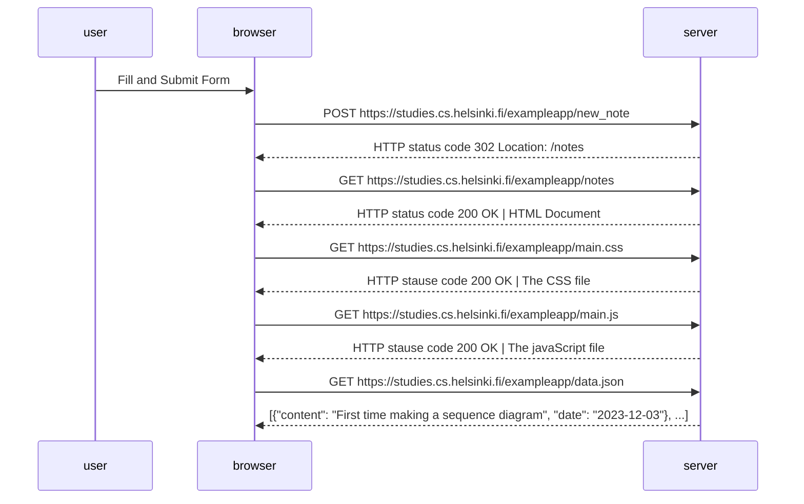

```mermaid
sequenceDiagram
    participant user
    participant browser
    participant server
user->>browser:Fill and Submit Form
browser->>server: POST https://studies.cs.helsinki.fi/exampleapp/new_note
server-->>browser: HTTP status code 302 Location: /notes
browser->>server: GET https://studies.cs.helsinki.fi/exampleapp/notes
server-->>browser: HTTP status code 200 OK | HTML Document
browser->>server: GET https://studies.cs.helsinki.fi/exampleapp/main.css
server-->>browser: HTTP stause code 200 OK | The CSS file
browser->>server: GET https://studies.cs.helsinki.fi/exampleapp/main.js
server-->>browser: HTTP stause code 200 OK | The javaScript file
browser->>server: GET https://studies.cs.helsinki.fi/exampleapp/data.json
server-->>browser: [{"content": "First time making a sequence diagram", "date": "2023-12-03"}, ...]
```