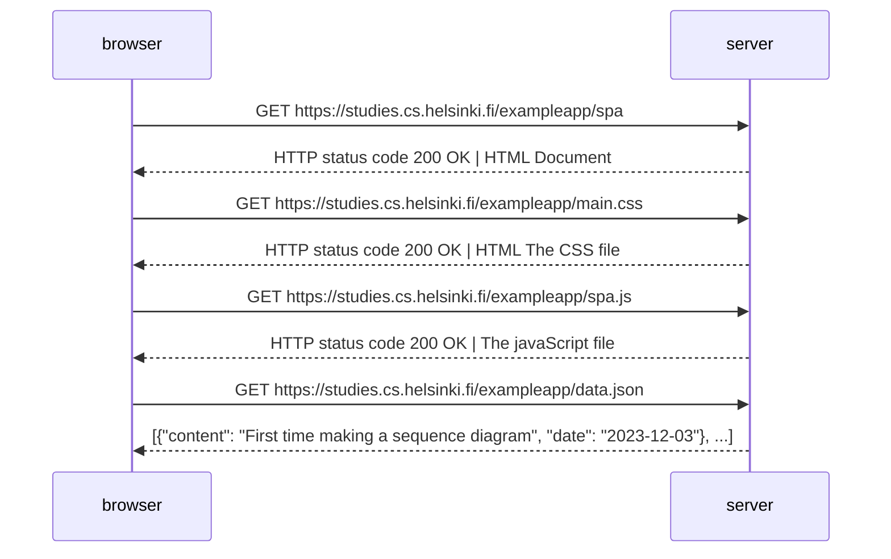

```mermaid
sequenceDiagram
    participant browser
    participant server
browser->>server: GET https://studies.cs.helsinki.fi/exampleapp/spa
server-->>browser: HTTP status code 200 OK | HTML Document
browser->>server: GET https://studies.cs.helsinki.fi/exampleapp/main.css
server-->>browser: HTTP status code 200 OK | HTML The CSS file
browser->>server: GET https://studies.cs.helsinki.fi/exampleapp/spa.js
server-->>browser: HTTP status code 200 OK | The javaScript file
browser->>server: GET https://studies.cs.helsinki.fi/exampleapp/data.json
server-->>browser: [{"content": "First time making a sequence diagram", "date": "2023-12-03"}, ...]
```